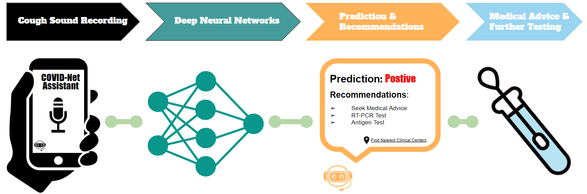

# COVIDNet-Assistant

<p align="center">
	
	<br>
	<em></em>
</p>


This code is for the paper **COVID-Net Assistant: A Deep Learning-Driven Virtual Assistant for Early COVID-19 Recommendation** 

**Link to the [paper](https://arxiv.org)[add link]**

<p align="center">
	
	<br>
	<em>Figure 1: Overview  of COVID-Net Assistant workflow.</em>
</p>

**COVID-Net Assistant is core part of COVID-Net, a global open source, open access initiative dedicated to accelerating advancement in machine learning to aid front-line healthcare workers and clinical institutions around the world fighting the continuing pandemic. Link to COVID-Net portal: [here](https://alexswong.github.io/COVID-Net/)**

**Note: The COVID-Net models provided here are intended to be used as reference models that can be built upon and enhanced as new data becomes available. They are currently at a research stage and not yet intended as production-ready models (not meant for direct clinical diagnosis), and we are working continuously to improve them as new data becomes available. Please do not use COVID-Net for self-diagnosis and seek help from your local health authorities.**


## Abstract

As the COVID-19 pandemic continues to put significant burden on healthcare systems around the world, there has been growing interest into finding inexpensive symptom pre-screening and recommendation methods to assist in efficient use of available medical resources such as PCR tests. In this study, we introduce the design of COVID-Net Assistant, an efficient virtual assistant designed to provide symptom prediction and recommendations for COVID-19 by analyzing users' cough recordings through deep convolutional neural networks. We explore a variety of highly customized, lightweight convolutional neural network architectures generated via machine-driven design exploration (which we refer to as COVID-Net Assistant neural networks) on the Covid19-Cough benchmark dataset comprised of 381 cough recordings from a COVID-19 positive cohort verified by PCR test. Our experimental results shows promising, with the COVID-Net Assistant neural networks demonstrating robust predictive performance, achieving AUC scores of over 0.93, with the best score over 0.95 while being fast and efficient in inference.  The COVID-Net Assistant models made available in an open source manner through the COVID-Net open initiative and, while not a production-ready solution, we hope their availability acts as a good resource for clinical scientists, machine learning researchers, as well as citizen scientists to develop innovative solutions. © 2022 .


## Table of Contents
1. [Requirements to install on your system](#requirements)
2. [How to download and prepare the Covid19-Cough dataset](docs/dataset.md)
3. [Steps for training, evaluation and inference](docs/train_eval_inference.md)
4. [Results and links to pretrained models](docs/models.md)


#### Requirements
The main requirements are listed below:

* Tensorflow 1.15
* librosa
* audiomentations
* keras
* Python 3.7
* Numpy
* Scikit-Learn
* Matplotlib
* ffmpeg
* ipywebrtc

Please use this script to insall all requirements
```
$ sudo apt install ffmpeg
$ pip3 install -r requirements.txt
$ jupyter nbextension enable --py widgetsnbextension
```

#### Contact

If there are any technical questions after the README, FAQ, and past/current issues have been read, please post an issue or contact:

* p23shi@uwaterloo.ca
* y3222wan@uwaterloo.ca

#### Citation (TODO add citation)

```
@article{

}

```
