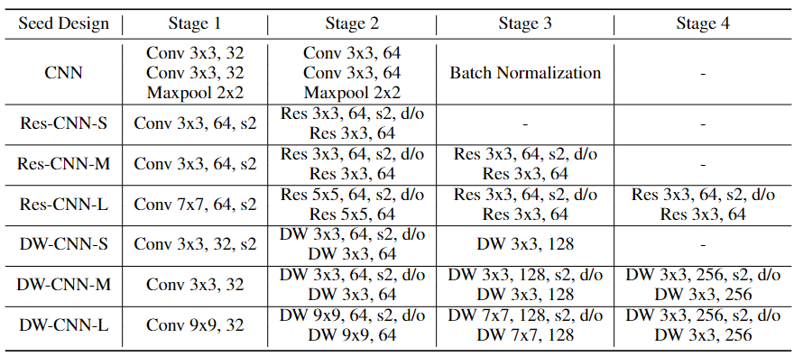

# Pretrained Models

The naming convention for models uses the following format:
```
COVID-Net Assistant <seed design>
```
For example, a COVID-Net Assistant model generated with Res-CNN-S seed design (i.e. small model based on residual blocks), which was trained on the dataset's verified-only split would be called "COVID-Net Assistant Res-CNN-S".

## COVID-Net Cough Models on Verified-Only Split [TODO: upload pre-trained checkpoints]
These models are trained and tested on the Verified-Only Split of Covid19-Cough dataset

## Seed Architectures
Seed Design used to generate final COVID-Net Assistant architectures via Generative Synthesis.

<p align="left">
	
	<br>
</p>


### Performance of Seed Architectures on All-Data Split and Verified-Only Split 

| Seed Design | AUC             | Latency WORKSTN (ms) | Latency SBC (ms) | Parameters (K) | FLOPs (M) | AUC             |
|-------------|-----------------|----------------------|------------------|----------------|-----------|-----------------|
| CNN         | 0.7925 / 0.9381 | 3.84                 | 32.8             | 65.3           | 491.3     | 0.7815 / 0.9508 |
| Res-CNN-S   | 0.7912 / 0.9285 | 3.06                 | 23.5             | 367.8          | 249.3     | 0.7828 / 0.9349 |
| Res-CNN-M   | 0.7897 / 0.9251 | 4.19                 | 29.6             | 927.5          | 367.9     | 0.7887 / 0.9394 |
| Res-CNN-L   | 0.7942 / 0.9204 | 5.2                  | 48.5             | 1158.2         | 675.6     | 0.8039 / 0.9388 |
| DW-CNN-S   | 0.7786 / 0.9279 | 3.47                 | 8.84             | 18             | 22.3      | 0.786 / 0.933   |
| DW-CNN-M   | 0.7722 / 0.941  | 4.19                 | 10.27            | 142.1          | 27.5      | 0.7832 / 0.9304 |
| DW-CNN-L   | 0.7829 / 0.9322 | 20.6                 | 52.5             | 159            | 149.8     | 0.7692 / 0.9305 |


## COVID-Net Assistant Models, Generated via Generative Synthesis with Seed Designs


| Model Name | AUC             | Latency WORKSTN (ms) | Latency SBC (ms) | Parameters(K) | FLOPs(M)     | Pre-trained Weights      |
|-------------|-----------------|----------------------|------------------|---------------|--------------|--------------------------|
| COVID-Net Assistant CNN         | 0.7815 / 0.9508 | 2.4 / 1.72           | 10.7 / 9.44      | 6.6 / 4.6     | 63.3 / 45.8  | [All-Data](https://drive.google.com/drive/folders/1hxPcgrW323Y-XVt32SMykGjfcaKplkI1?usp=share_link) / [Verified-Only](https://drive.google.com/drive/folders/11fHvP1Wlv8udmz9JzxzDXKPKrXDOptj2?usp=sharing) |
| COVID-Net Assistant Res-CNN-S  | 0.7828 / 0.9349 | 2.29 / 2.22          | 8.76 / 10.6      | 74.3 / 76.3   | 25.2 / 59.7  | [All-Data](https://drive.google.com/drive/folders/1gesHOP_PgYhUix5WJASjmy7RPPBuvN_n?usp=sharing) / [Verified-Only](https://drive.google.com/drive/folders/1NvEbsFFFh7_bYJMZAoYAlw355QuZ-g-Z?usp=sharing) |
| COVID-Net Assistant Res-CNN-M  | 0.7887 / 0.9394 | 2.64 / 2.61          | 11.2 / 12.1      | 161.4 / 228.8 | 39.7 / 55.6  | [All-Data](https://drive.google.com/drive/folders/1tdQ9r1BIqIuc3r_h7iXxLMEqdF1rjg01?usp=sharing) / [Verified-Only](https://drive.google.com/drive/folders/1SN2Bdyx640C0MIXGEeuYhEvqRrmwkOo-?usp=sharing) |
| COVID-Net Assistant Res-CNN-L   | 0.8039 / 0.9388 | 3.24 / 3.05          | 21.8 / 13.6      | 254.8 / 229.0 | 175.9 / 66.7 | [All-Data](https://drive.google.com/drive/folders/1RPyIts3wfp4Yo7f7NMK9WfYYRtId3E80?usp=sharing) / [Verified-Only](https://drive.google.com/drive/folders/1EgahQeVvOa7-395yvrHZHYKJM9320agp?usp=sharing) |
| COVID-Net Assistant DW-CNN-S  | 0.786 / 0.933   | 2.34 / 2.31          | 4.94 / 5.39      | 3.5 / 3.9     | 3.9 / 4.5    | [All-Data](https://drive.google.com/drive/folders/1yqP_0JSKw5Ys6R1MxZOUjrnALrmr3zD-?usp=sharing) / [Verified-Only](https://drive.google.com/drive/folders/1wm7kDAcSxNUSdkO3Zw7sBN44BEO_3ggT?usp=sharing) |
| COVID-Net Assistant DW-CNN-M  | 0.7832 / 0.9304 | 3.06 / 3.18          | 6.74 / 6.98      | 25.2 / 23.7   | 6.2 / 6.5    | [All-Data](https://drive.google.com/drive/folders/15BTjsnqdwbqU3LUgF4VPUhzUtbCD1YEt?usp=sharing) / [Verified-Only](https://drive.google.com/drive/folders/17XuEVvrCqquD5uDGLrIdFpgr6UT40URT?usp=sharing) |
| COVID-Net Assistant DW-CNN-L  | 0.7692 / 0.9305 | 14 / 14.1            | 35.1 / 35.2      | 34.1 / 35.2   | 71 / 71.1    | [All-Data](https://drive.google.com/drive/folders/1cxt4fC6ownmitGj9CeSWshTSVQ5JiZAh?usp=share_link) / [Verified-Only](https://drive.google.com/drive/folders/1g1_j7lH_xaKksNlqaUtKqrmJACKdHMyS?usp=sharing) |


Format follows: "evaluiation on All-Data Split / evaluiation on Verified-Only Split"